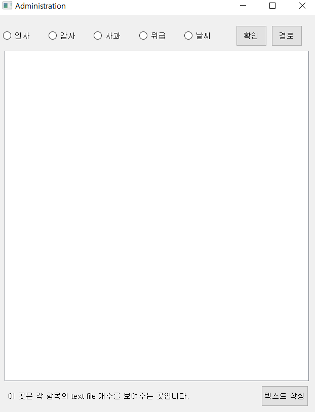

# 1. 개요

### 1.1 팀
대구 AI 스쿨

심화 3팀(매콤찜닭 스카이넷)

김동영, 장창대, 김성진, 조유경

### 1.2 프로젝트
Sound to Text 자연어 처리 프로젝트

한국어 음성 입력을 음성->텍스트로 변환 후

변환된 텍스트를 [인사, 사과, 감사, 위급, 날씨] 총 5개의 클래스로 분류하여 식별

# 2. 요구사항
음성 식별에 애저 STT, 한글 토크나이저로 konlpy를 사용
1. pip install로 설치가능한 부분은 requirements.txt에 들어있어서pip install -r requirements.txt

       pip install -r requirements.txt
2. pytorch 설치

자기 환경에 맞게 설치해야하는데,
윈도우기준

      pip3 install torch==1.9.0+cu102 torchvision==0.10.0+cu102 torchaudio===0.9.0 -f https://download.pytorch.org/whl/torch_stable.html
   
https://pytorch.org/
에서 

를 참고한다
   
3. konlpy를 사용하기 위하여 jdk를 설치하고 환경 변수를 설정해야한다

openjdk 설치 : https://openjdk.java.net/install/
환경변수 설정법 : https://blog.naver.com/PostView.nhn?blogId=alcmskfl17&logNo=221870079271   

4. pip install로 설치할 수 없는 PyAudio, JPype는 installData 폴더에 설치용 .whl 파일이 들어있다

특이사항으로 호환성 문제가 있어 jpype의 버전을 최신 버전이 아니라
<=1.2 버전을 사용해야한다

예를 들어 자신의 파이썬 버전이 3.8이라면 cp38 파일을 설치하면 된다

윈도우 64bit 외의 경우에는 아래 링크에서 직접 다운로드하도록 하고

Jpype : https://www.lfd.uci.edu/~gohlke/pythonlibs/#jpype

PyAudio : https://www.lfd.uci.edu/~gohlke/pythonlibs/#pyaudio

      pip install <.whl파일 경로>
와 같은 명령어를 사용하여 설치한다

참고 : https://catsirup.github.io/ai/2020/04/21/nlp_data_argumentation.html (eda 기반 한글 text augmentation)

# 3. 사용방법

    python main.py
main gui 실행
### 1. 음성 입력 및 예측하기
1. SubKey = 애저 STT subscriptionkey 입력
2. WeightPath = 예측에 사용할 pth 파일 경로를 browse로 입력
3. OK 버튼 클릭
4. mic start 버튼을 누른 후, 음성 입력
5. mic stop 버튼을 클릭하면 식별된 음성이 텍스트로 변환되어 출력
6. predict 버튼을 클릭하면 예측된 라벨을 출력

### 2. 수동 학습 데이터 만들기
1. SavePath = 데이터가 저장될 위치를 browse로 입력
2. 타이핑 체크박스 클릭
3. 수동으로 데이터 입력
4. 인사, 사과, 감사, 위급, 날씨 중 라벨을 선택
5. save 버튼을 누르면 SavePath에 학습 데이터 저장

### 3. 학습하기

1. 학습 및 평가 데이터 폴더 경로 입력
2. pth 파일의 저장 경로 입력
3. 학습 및 평가 데이터 분리 비율 입력
4. learning rate 입력
5. epochs 입력
6. batch size 입력
7. train start 버튼 클릭

### 4. 한글 text agumentation 기능

1. 타겟 데이터 폴더 경로 입력
2. agument start 버튼 클릭

### administration.py를 이용한 text 관리기능

1. python administration.py를 실행한다
2. 경로를 눌러서 텍스트 파일이 있는 폴더를 지정한다(conversationSet 폴더이다)
3. 라디오 버튼을 눌러서 어떤 데이터를 불러오는지 지정한다.
폴더명의 기준으로 파일이 배치되어 있기에 다음을 따른다
    + emergency는 위급
    + greeting은 인사
    + sorry는 사과
    + thanks는 감사
    + weather는 날씨
4. 확인을 눌러 그 폴더의 텍스트 파일명과 그 내용을 확인 할 수 있다.

### administration.py를 이용한 text 작성기능

1. python administration.py를 실행한다
2. 위의 text 관리 창이 뜨면 창 아래에 텍스트 작성 버튼을 누른다
3. 그러면 지금의 text 작성 기능을 가진 창이 뜬다
4. 저장 경로를 conversationSet안의 폴더 중 하나로 설정한다. 
5. 라디오 버튼을 눌러서 어떤 데이터를 저장하는지 지정한다.
폴더명의 기준으로 파일이 배치되어 있기에 다음을 따른다
    + emergency는 위급
    + greeting은 인사
    + sorry는 사과
    + thanks는 감사
    + weather는 날씨
6. 그리고 그 아래의 입력란에 텍스트를 입력하고 저장하기 버튼을 누르거나 ctrl + s를 눌러 저장한다
7. 관리창으로 가려면 취소 돌아가기를 누른다.
8. 내가 쓴 텍스트 결과를 보려면 그 안에 관리 창으로 돌아가 다시 경로를 설정하고 라디오 버튼을 누른 뒤에 확인을 누른다
